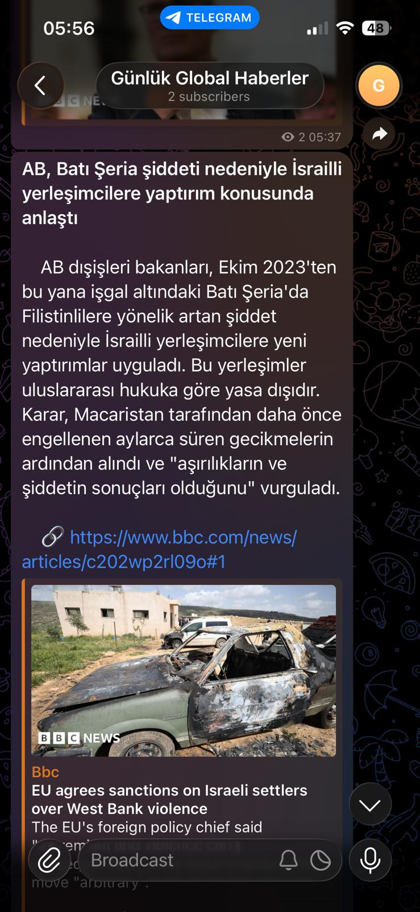
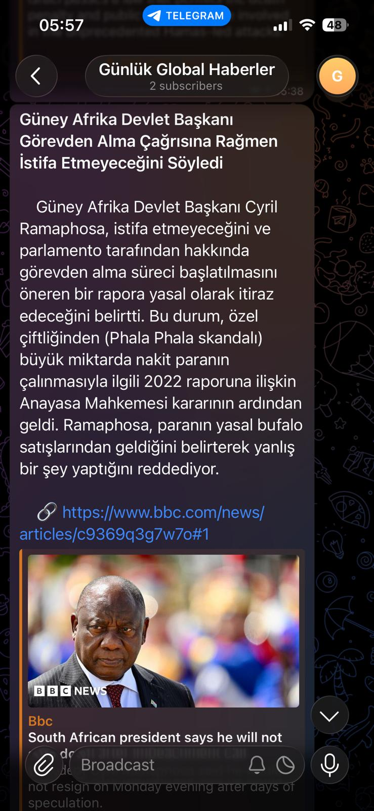
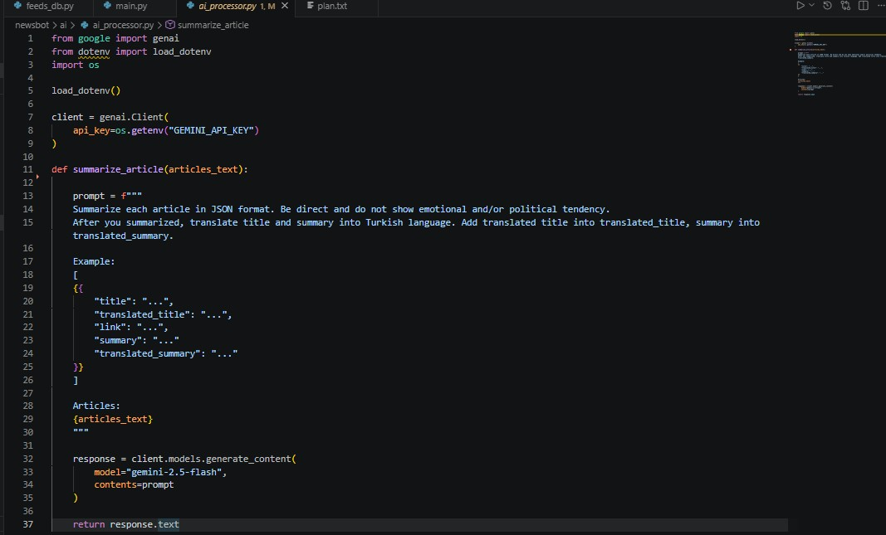

# NewsBot 🌍📰

A fully automated global news bot that fetches news from RSS feeds, summarizes articles using AI, translates them into Turkish, and publishes formatted posts directly to Telegram.

## Features

* Fetches news from RSS feeds (currently BBC)
* Filters and processes incoming articles
* Stores articles in PostgreSQL
* AI-powered article summarization
* Automatic Turkish translation
* Direct Telegram publishing
* JSON-based AI processing pipeline
* Scalable architecture for future integrations

---

## Demo

### Telegram Channel

👉 https://t.me/newsbot_global

---

## Screenshots

### Telegram Output





### Development Environment



---

## Tech Stack

* Python
* PostgreSQL
* RSS Feeds
* Telegram Bot API
* Gemini 2.5 Flash
* AI Summarization & Translation

---

## How It Works

```text
RSS Feed
   ↓
Article Fetching
   ↓
Filtering & Processing
   ↓
PostgreSQL Storage
   ↓
AI Summarization
   ↓
Turkish Translation
   ↓
Telegram Publishing
```

---

## Project Structure

```bash
newsbot/
│
├── config/
├── elimination/
├── db/
├── ai/
├── telegram/
├── ai_summary_db.py
├── feeds_db.py
├── main.py
└── requirements.txt
```

---

## Installation

### Clone the repository

```bash
git clone https://github.com/nbeser/newsbot.git
cd newsbot
```

### Create virtual environment

```bash
python -m venv venv
```

### Activate virtual environment

#### Windows

```bash
venv\Scripts\activate
```

#### Linux/macOS

```bash
source venv/bin/activate
```

### Install dependencies

```bash
pip install -r requirements.txt
```

---

## Environment Variables

Create a `.env` file:

```env
DB_HOST="your host"
DB_PORT="your port"
DB_NAME="your database name"
DB_USER="your database user"
DB_PASSWORD="your database password"

GEMINI_API_KEY="your key"

CHANNEL_ID="your telegram channel id"
BOT_TOKEN="your telegram bot token"
```

---

## Current Status

Current version focuses on:

* Telegram publishing
* Single RSS source (BBC)
* Turkish translation
* Staying within Gemini free-tier limits

To reduce API usage, multiple news articles are sent to Gemini in a single request and returned as structured JSON output.

---

## Roadmap

### Next Steps

* Deploy to server
* Add cron scheduling
* Improve automation frequency

### Future Improvements

* One article → one AI request
* Markdown (.md) article formatting
* Multi-language support
* Twitter/X integration
* Web dashboard
* Categorization & analytics
* AI SKILLS pipeline

---

## Scalability

The infrastructure is designed for expansion and continuous execution.

Possible future integrations:

* Multiple RSS providers
* Real-time analytics
* Web interface
* Queue systems
* Multi-platform publishing


---

## Author


Nurettin Beşer - [https://www.instagram.com/zcodingsolutions/](https://www.instagram.com/zcodingsolutions/)

Project Link: [https://github.com/nbeser/newsbot/](https://github.com/nbeser/newsbot/)


Contributer : [https://github.com/nbeser](https://github.com/nbeser)

Linkedin : [https://www.linkedin.com/in/nurettin-beser-arcnbsr23](https://www.linkedin.com/in/nurettin-beser-arcnbsr23)


<p align="right">(<a href="#readme-top">back to top</a>)</p>
